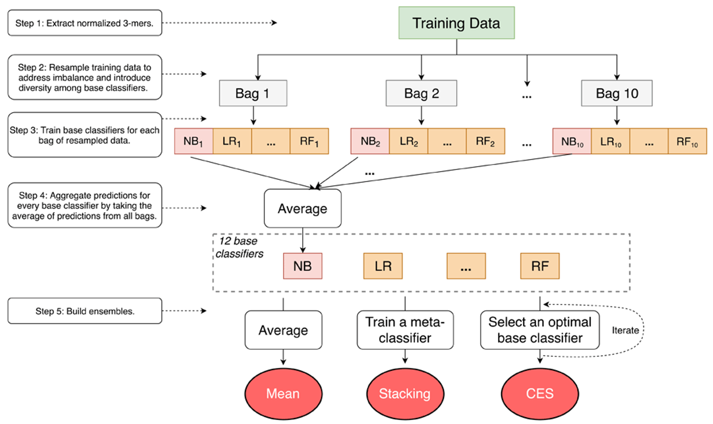

<a href='https://f1000research.com/articles/7-1577/v1'>Download paper here</a>

[GitHub Repository](https://github.com/GauravPandeyLab/LargeGOPred){:target=&quot;_blank&quot;}

Recommended citation: Wang L, Law J, Kale SD et al. Large-scale protein function prediction using heterogeneous ensembles. F1000Research 2018, 7(ISCB Comm J):1577