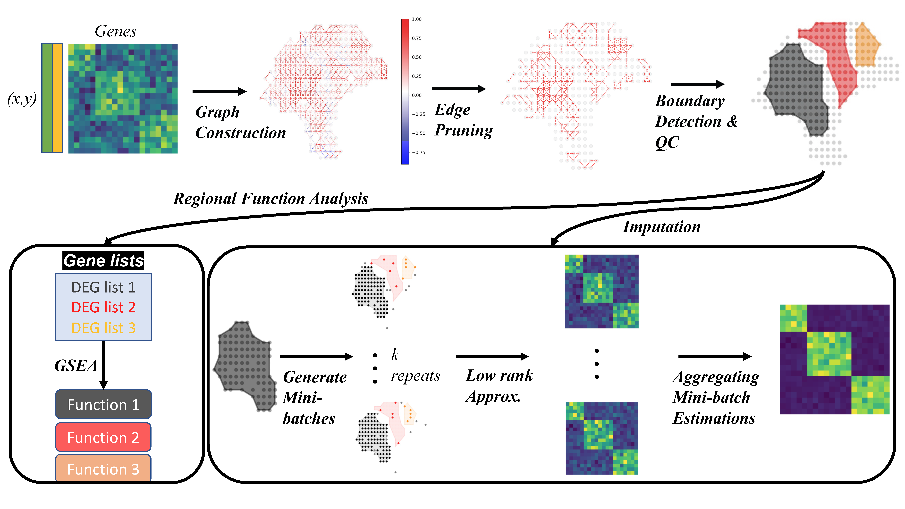

<a href='https://www.nature.com/articles/s41467-022-34567-0'>Download paper here</a>

[GitHub Repository](https://github.com/linhuawang/MIST){:target=&quot;_blank&quot;}

Recommended citation: Wang, L., Maletic-Savatic, M. & Liu, Z. Region-specific denoising identifies spatial co-expression patterns and intra-tissue heterogeneity in spatially resolved transcriptomics data. Nat Commun 13, 6912 (2022).