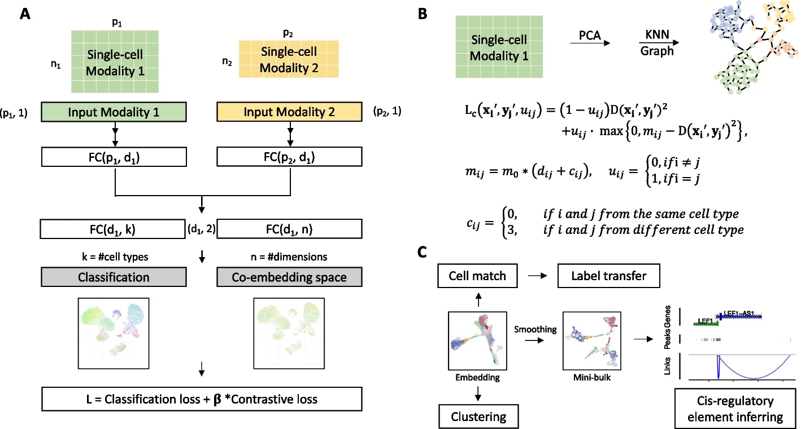

<a href='https://bmcbioinformatics.biomedcentral.com/articles/10.1186/s12859-022-05126-7'>Download paper here</a>

[View paper here](https://bmcbioinformatics.biomedcentral.com/articles/10.1186/s12859-022-05126-7)

Recommended citation: Liu, C., Wang, L. & Liu, Z. Single-cell multi-omics integration for unpaired data by a siamese network with graph-based contrastive loss. BMC Bioinformatics 24, 5 (2023).